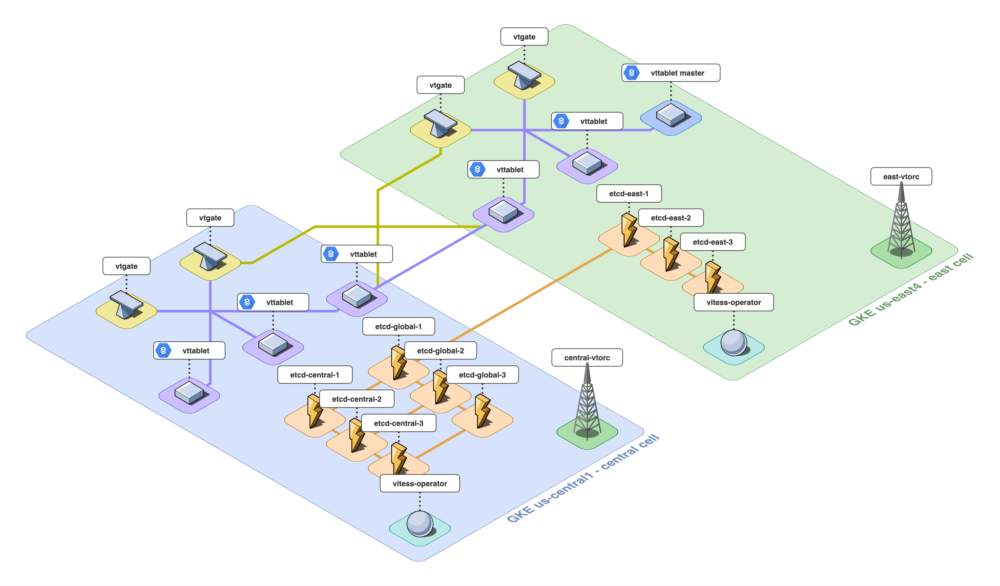

## Vitess Multi-Region Cluster on GKE

:video_camera: [Video Demo](https://youtu.be/6ymNyTHD3T8) :video_camera:

### Steps (high level)
- Create 2 clusters (east, central)
- Add kubeconfig contexts for both
- Enable ncesaary GCP API's `gke-msc.sh`
- Check MCS membership list
- Deploy Vitess operator to both clusters
- Create EtcdLockserver and ServiceExport spec in both clusters
- Wait ~5m for service imports to become available in both clusters
- Deploy Vitess cluster in central
- Deploy Vitess cluster in east
- Check logs for cross-region connectivity errors
- Confirm pod communication with orchestrator `./orcpf.sh` and `http://localhost:3000`
- Confirm reads/writes in both GKE clusters
- DONE!

### References
- [Setup Multi-Cluster-Service in GKE](https://cloud.google.com/kubernetes-engine/docs/how-to/multi-cluster-services)
- [PlanetScaleDB Operator API](https://docs.planetscale.com/psdb-operator/api)
- [Manifests and Config](https://github.com/voxoco/vitess-demo)
- [Vitess Operator](https://github.com/vitessio/vitess/tree/master/examples/operator)
- [Vitess Operator Federation, Architecture and Requirements](https://github.com/planetscale/vitess-operator/blob/master/docs/architecture/federation.md)

### CHANGELOG
- 4/24/21: Added support for distributed Global Lockserver. Now the first 2 etcd instances are deployed to central while the 3rd is deployed to east.
  This has been tested and also working with 3 clusters (each having a single Global lockserver etcd instance)
